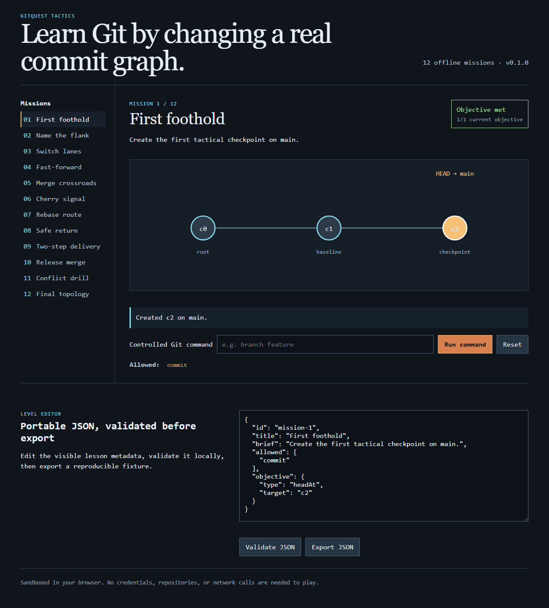

# GitQuest Tactics

[](https://github.com/KanadeK/gitquest-tactics/actions/workflows/ci.yml) [](LICENSE) [](https://github.com/KanadeK/gitquest-tactics/releases)

GitQuest Tactics turns branch, merge, rebase, and cherry-pick into tactical puzzles judged from the commit graph, not click order. It is an offline-first learning tool for Git beginners, bootcamps, and team onboarding.



- Every mission runs against a deterministic commit graph with Git-like branch and parent semantics.
- Twelve authored missions, including fast-forward, merge, rebase, cherry-pick, and invalid-command drills.
- Built-in JSON level editor validates and exports portable lesson fixtures in the browser.

## Quick start

```bash
npm ci
npm run dev
```

Then open the address Vite prints. To solve the first mission, enter `commit checkpoint`; the graph moves from `c1` to `c2` and the mission is evaluated immediately.

## What it is and is not

The learning sandbox models commit ancestry, branch pointers, HEAD, fast-forwarding, merge commits, rebase replay, and cherry-pick copies. Commands are allowlisted per mission, and rejected commands leave the source graph unchanged.

It is deliberately not a replacement for a local Git client, a hosted repository integration, or a credential manager. The MVP stores no account data and makes no network calls while a learner plays.

## Architecture

`src/core` contains the deterministic graph model, command engine, objectives, and level definitions. `src/features` renders the React workspace. `src/workers` provides a message-based execution boundary for moving command work off the UI thread. The browser UI uses D3 scales to lay out a graph from actual commit-parent relationships.

See [Architecture](docs/ARCHITECTURE.md), the [Chinese README](README.zh-CN.md), and [competitor scan](docs/COMPETITOR_SCAN.md). A public-repository sample search found no active same-name, highly isomorphic project; the differentiator is explicit topology assertions plus editable, portable missions, rather than an open-ended tutorial.

## Levels and examples

The complete authored level pack is in `src/core/levels.ts`; its deterministic sample data is committed with the repository. `examples/error-demonstrations.json` captures three failure paths that are also covered by tests.

## Development and verification

```bash
npm run lint
npm run typecheck
npm run test:coverage
npm run test:e2e
npm run build
npm run package
make verify
make demo
make package
make release-check
```

On Windows without `make`, use `npm run lint && npm run typecheck && npm run test:coverage && npm run test:e2e && npm run build`, then `npm run package`, `npm run demo`, and `npm run release-check`.

## Security and privacy

The app is self-contained: it does not inspect local repositories, transmit commands, or request a token. See [Privacy and security](docs/PRIVACY_AND_SECURITY.md) and [Security policy](SECURITY.md).

## Roadmap

The next milestone adds browser-backed isomorphic-git filesystem execution behind the existing adapter boundary, instructor level-pack sharing, and localized lesson copy. See `docs/ROADMAP.md`.

## Contributing

Issues and pull requests are welcome. Read [CONTRIBUTING.md](CONTRIBUTING.md) and follow the [Code of Conduct](CODE_OF_CONDUCT.md). Licensed under [MIT](LICENSE).
